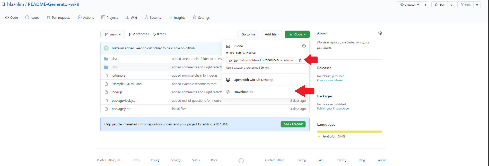
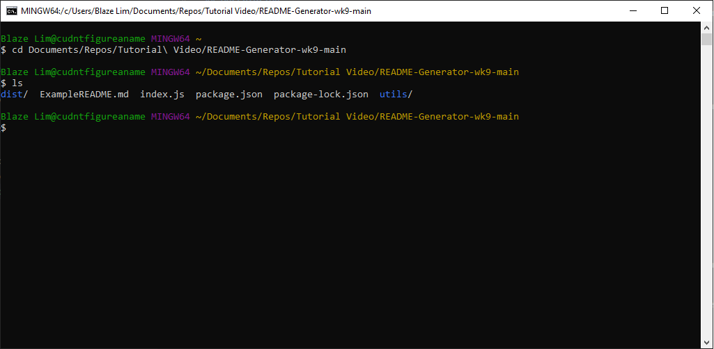
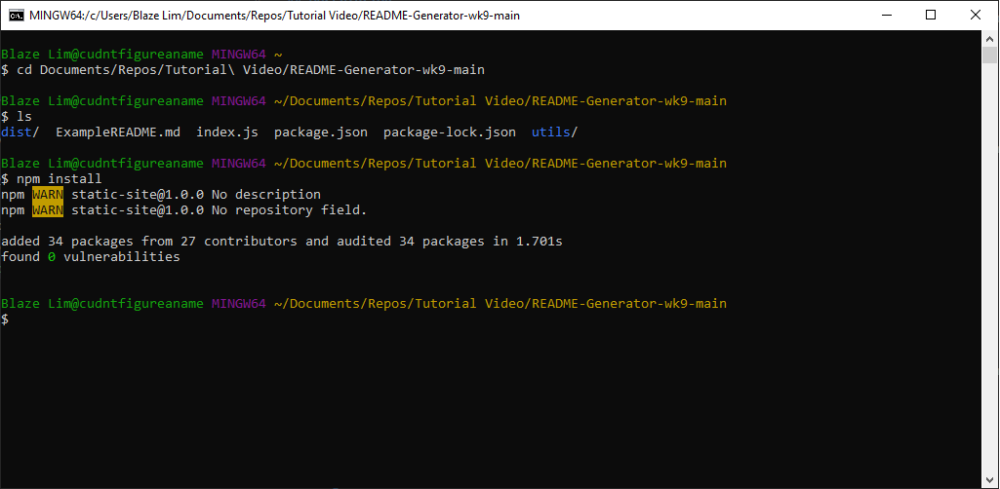
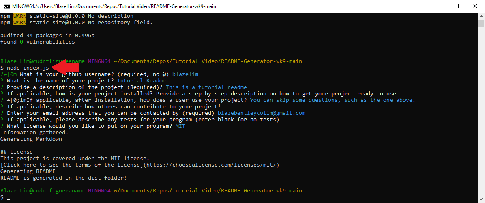

# README Generator

## Description
This project is a client sided README generator that allows one to generate a professional README for their other projects. This project uses the node package 'inquirer' to gather information about your project, including your project title, description, installation procedure, usage procedure, ways others can contribute, and ways others can test your project.

Additional features of the README generator include:
* an automatically generated a questions section, which allows others to contact you via email or on your github. 
* a table of contents will also be added depending on the questions that are completed.
* An automatic license generator, fit with a badge generator and an automatically generated link to the license.

## Table of Contents
* [Video Walkthrough for Installation and Usage](#video-walkthrough-for-installation-and-usage)
* [Installation](#installation)
* [Usage](#usage)
* [License](#license)
* [Questions](#questions)

## Video Walkthrough for Installation and Usage
https://drive.google.com/file/d/1Lju7d43jtAjhlM5xxZEdirSLjsIWLt75/view?usp=sharing

## Installation

1. Download the project either by cloning it or by downloading the zip file (and unzipping as necessary)

2. In your command line interface (such as your terminal or commonly referred to as your CLI), navigate to root directory. Using 'ls' will let you know you are in the right place if you can see the names of the files in the picture above.

3. In your CLI, run 'npm install' to install the projects dependencies.

4. Your project is now ready to go.

## Usage

1. In your CLI in the root directory of the project, run 'node index.js'
2. Answer the prompts as they are given to you. (You may skip questions that are not required)
3. After all questions have been addressed, the generated README will be found in the 'dist' folder, which is located in the root directory.

## License
This project is covered under the MIT license.
[Click here to see the terms of the license](https://choosealicense.com/licenses/mit/)

## Questions
Any questions or concerns?
Contact me on my github: [blazelim](https://github.com/blazelim/)

Or email me at: blazebentleycolim@gmail.com
